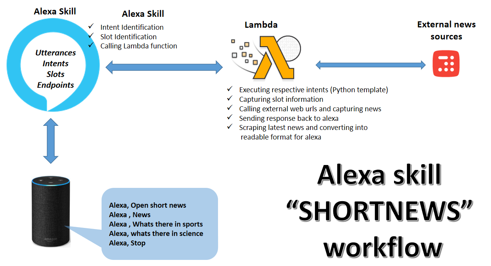

# Alexa Skill "SHORT NEWS" 
## Introduction 
Short News  alexa skill provides user the latest update of India news from different categories like  education, science, technology, entertainment, sports, business, etc. It is based on “Inshorts” News. Inshorts aggregates the news from many sources and makes it very abstract. It describes the entire news in just 60 words. “ShortNews” reads out all the news items in very abstract manner.
The user doesn’t need to spend time over internet or television to know news. He/she can just ask Alexa to brief them, User can listen to short news without any interruption within his/her activities.
There are many flash briefing skills but “ShortNews” overcomes them by its news diversity, precise and timely content delivery.



```markdown
1. User can start/invoke  this skill by saying:

                  “Alexa, Open short news”

2. And then user can get generic news or categories’ news by saying following utterances:
To hear Generic News:

                  “Headlines",
                  "headlines please",
                  "What’s there in headlines?”,
                  "What’s in today’s news",
                  "Tell me Inshorts",
                  "News".

3. To hear Category News like about politics, sports, technology etc:

                  "What’s there in {category}",
                  "{category} news”
                  
    For example –  Headlines from politics, 
                   What’s there in sports?,   etc.
    
    Thus, user will always be able to listen to the latest on his/her favourite topics.
    “ShortNews” skill keeps us updated.
    
4. To stop the skill:

                  “Alexa, stop.”
                  “Alexa, silent.”

```
## File Structure Information
1. ShortNews.json : 
This file has alexa skill info which is to be set in alexa skill kit development.
2. lambda_function.py:
This script is lambda function which has to be deployed over AWS lambda.
3. Amazon_Alexa_Deliverables_Alexa_Skill_Team_Minman.pdf :
Details of TECHGIG Hackathon submission.
## Future Scope
Skill can be enhanced for interrupting at a time to fetch more information on specific news item or mail the news link to the user’s email ID. It also can be leveraged to skip a news item which user is not interested.

For example – 
“Alexa, tell me the whole news for this item.” “Alexa, Skip.” “Alexa, mail me the link for this item.”

## Conclusion
Short news is the flashbriefingskill, which facilitates the user to be updated with latest news. Use can ask alexa to be more precise by selecting categories. Short news fetches and parsed the news from many sources and makes it into more readable format. It is unique by its nature like news diversity, precise and timely content delivery. The skill could be enhanced to the features which are mentioned in future scope.


          
